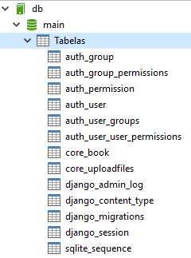
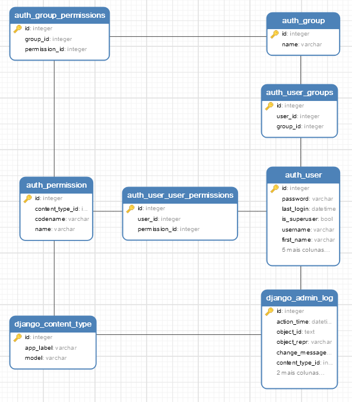
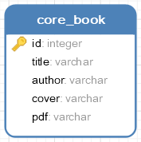
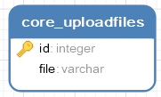
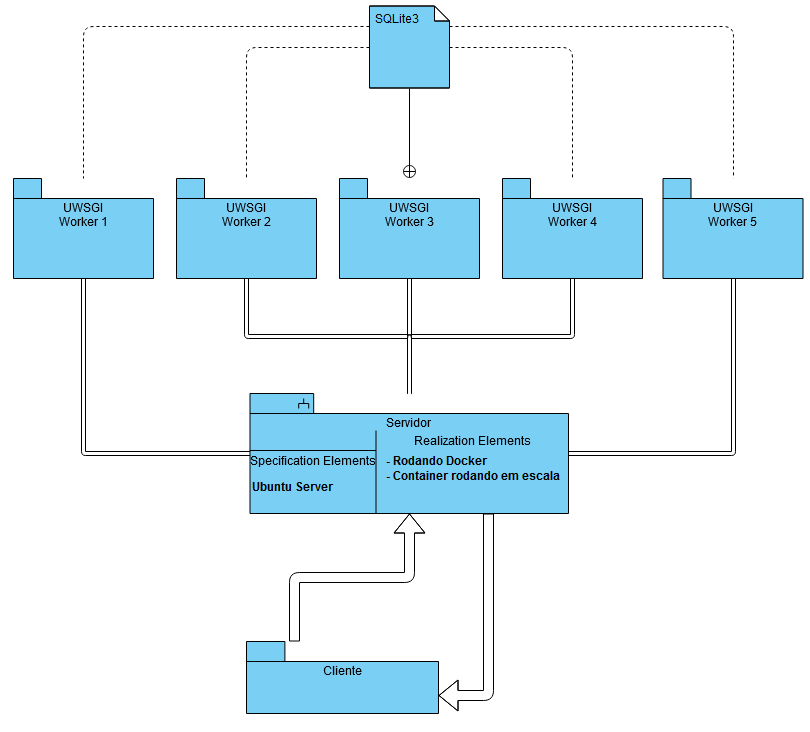

# Banco Itaú | File Transfer
## Case – Engenheiro Suporte de Integração

#Sumário:
* * *
1. [Plano de Trabalho](#1-plano-de-trabalho)
2. [Tecnologias utilizadas](#2-tecnologias-utilizadas)
3. [Embasamento teórico](#3-embasamento-terico)
4. [Modelagem da base de dados](#4-modelagem-da-base-de-dados)
5. [Diagrama de implantação da solução](#5-diagrama-de-implantao-da-soluo)
6. [Referências utilizadas](#7-referncias-utilizadas)
7. [Imagem do Docker publicada no Docker Hub](#8-imagem-do-docker-publicada-no-docker-hub)
* * *

## 1) Plano de Trabalho
Foi desenvolvida uma interface web em Python para transferência dos arquivos, conforme informado no case.

Acabei substituindo o _JWT_ pelo _CSRF Protection_. Falo sobre ele no assunto de [Tecnologias utilizadas](#2-tecnologias-utilizadas).

Em resumo, com exceção do JWT o plano inicial se manteve, não havendo desvios nos outros itens.

## 2) Tecnologias utilizadas
**Porque Python?**

Escolhi o Python como linguagem de programação por ter mais afinidade e trabalhar com ela na maioria do tempo.

No desafio foi utilizado o Python na versão 3.6, junto com o Django 2.2.4 e o uWSGI para uso de *escalabilidade* da aplicação, contando com 5 workers configuráveis.

Foi utilizado também o fator de autenticação do próprio **Django-Admin** para realizar o login na plataforma.
Utilizo também o **CSRF Protection** que possui token de segurança na hora de realizar o upload dos arquivos _(esse
token é bastante utilizado em PHP e está presente fortemente na documentação do Django)._

Para **persistência dos dados**, eu preferi trabalhar com o **SQLite3** devido a facilidade da implementação e o projeto
não demandar tanto uso de conexão, etc. Entretanto, com o Django isso não seria problema. Ele consegue criar a modelagem
de dados em diferentes bancos relacionais **(ORM)**, por exemplo, MySQL, Postgres, etc.

## 3) Embasamento teórico
Dado as necessidades, pude concluir que o Django conseguiria por si só, atender a maioria dos pedidos deste case, e não só para esse case, digo em mais de um projeto. De fato, o framework é poderoso.

Quando desenvolvo alguma automação ou API para beckend eu prefiro utilizar o Flask, que é outro framework do Python. Porém, em cenários que requer mais do frontend, eu acabo optando pelo Django.

Pensando em uso de escalabilidade em aplicações web, tenho preferido utilizar bastante o uWSGI. O mesmo é simples, objetivo, fácil de configurar e poderoso.

Para os casos de PDF acima de 10MB, eu pensei em implementar um watcher-folder olhando para um diretório *NFS* ou *CIFS*
onde o usuário iria colocar os arquivos e em seguida serem consumidos pelo script, passando pela *pipelane* normal da
plataforma, sendo que, o watcher-folder faria um POST para api do **File-Transfer** *(URI exemplo: /api/upload)*

## 4) Modelagem da base de dados

Segue abaixo, telas capturadas do *software Navicat* para visualização das tabelas criadas pelo **Django-Admin**:

**Tabelas com relação:**

Porém, as duas principais do projeto são: **core_book** e **core_uploadfiles**

  -  

## 5) Diagrama de implantação da solução

## 7) Referências utilizadas

- Documentação no site oficial do Django: [https://docs.djangoproject.com/en/2.2/](https://docs.djangoproject.com/en/2.2/)
- Sobre o token CSRF: [https://docs.djangoproject.com/en/2.2/ref/csrf/](https://docs.djangoproject.com/en/2.2/ref/csrf/)
- Sobre os formulários do Django usando models: [https://django-crispy-forms.readthedocs.io/en/latest/](https://django-crispy-forms.readthedocs.io/en/latest/)

## 8) Imagem do Docker publicada no Docker Hub
O projeto está pronto dentro do meu repositório do DockerHub:

[https://hub.docker.com/r/wsalles/itau-file-transfer](https://hub.docker.com/r/wsalles/itau-file-transfer)

**Dica:**
Coloquei também aqui no repositório do Git o **Dockerfile** para saberem como foi realizado o build do projeto. 

#### Autor:
Wallace Salles < [wallace_robinson@hotmail.com](mailto:wallace_robinson@hotmail.com) >
